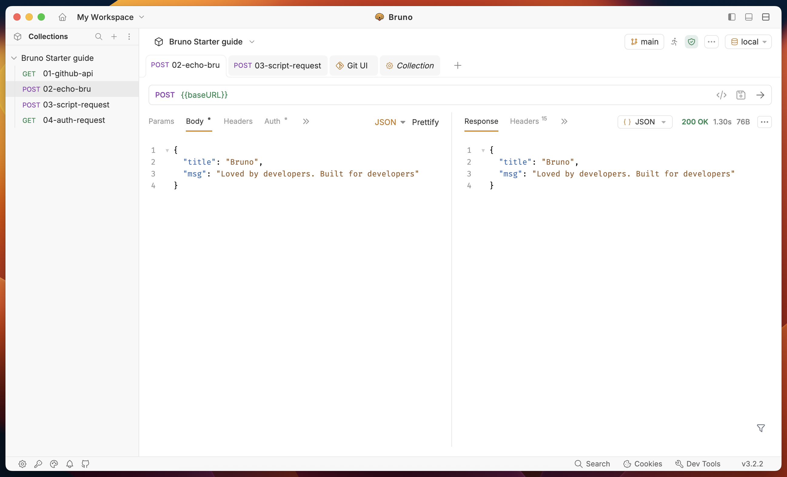

  

# Bruno Starter Guide

Bruno is an **open-source**, **Git-friendly**, **local-first** API client. This repository is the companion **Bruno Starter Guide** collection created by the Bruno team. It pairs with the official **[Quick Start](https://docs.usebruno.com/introduction/quick-start)** on the docs site and gives beginners a hands-on walkthrough inside the app.

  

---

## Getting started

**Use Fetch in Bruno** to open this collection in Bruno to validate your work, with one click, no manual `git clone` or open folder steps.

  

---

## What’s in this folder

After you **Fetch in Bruno** (above) or [clone](https://github.com/bruno-collections/bruno-starter-guide) the repo, you get an OpenCollection you can use in Bruno:

| Item                  | Purpose                                                                        |
| --------------------- | ------------------------------------------------------------------------------ |
| `opencollection.yml`  | Collection metadata (OpenCollection format)                                  |
| `*.yml` request files | Example and challenge requests (e.g. `github-api.yml`, `echo-bru.yml`)       |
| `environments/`       | Environment files such as `local.yml`                                        |
| `solutions.yaml`      | Reference solutions (optional to compare your work)                          |
| `submission/`         | **Where you place your exported OpenAPI file** after completing the challenges |

Open the **repository root** as the collection folder in Bruno so all requests and environments load correctly.

---

## How to submit your challenge

1. Complete **all 12 challenges** in the **[Quick Start](https://docs.usebruno.com/introduction/quick-start)** (steps, URLs, and success criteria are all there).
2. In Bruno, export the collection to **OpenAPI** (see the **OpenAPI specifications** section in the Quick Start).
3. Save the export as **`your-name.yaml`** (e.g. `jane-doe.yaml`).
4. Add that file to the **`submission/`** folder in this repository (see `submission/usebruno.yaml` as an example).
5. Open a pull request to the repository.

If anything is unclear, use the [Quick Start](https://docs.usebruno.com/introduction/quick-start) as the source of truth.

---

## Links

- [Bruno downloads](https://www.usebruno.com/downloads)  
- [Documentation](https://docs.usebruno.com)  
- [Main Bruno repository](https://github.com/usebruno/bruno)
